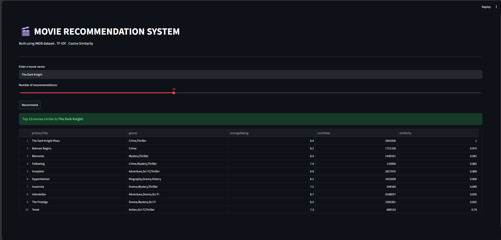

# 🎬 Movie Recommendation System
A content-based movie recommendation system built using the IMDB dataset that suggests similar movies based on genre, director, and ranting.

## 🔧 Tech Stack
- **Python**
- **Pandas** - data loading, cleaning, merging
- **Scikit-learn** - TF-IDF vectorization, cosine similaity
- **Streamlit** - interactive web UI

## 📦 Dataset
- [IMDB Non-Commercial Datasets] (https://datasets.imdbws.com/)
- Files used: 'title.basics.tsv' , 'title.ratings.tsv' , 'title.crew.tsv' , 'name.basics.tsv'

## ⚙️ How It Works
1. Loads and merges 4 IMDB datasets (~70,000 movies after cleaning)
2. Engineers features by combining genre, director name, and rating category per movie
3. Applies TF-IDF vectorization to convert text features into numeric vectors
4. Uses cosine similarity to find and rank the most similar movies

## 🚀 How to Run
'''bash
#Install dependencies
pip install -r requirements.txt
#Run the app
streamlit run userInterface.py
'''

## 📸 Demo

## 📁 Project Structure
'''
MOVIE RECOMMENDER /
|
|-- Data/       #IMDB .tsv files (not uploaded due to size)
|-- recommender.py      #Data pipeline + recommendation logic
|-- userInterface.py        #Streamlit UI
|--reuirements.txt
|_ README.md
'''